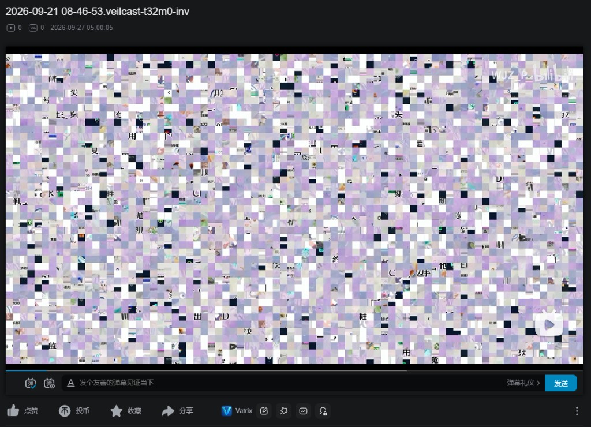

# Vatrix  —— 混映 基于分块置换 & 频谱倒置的视频编解码工具

<!-- PROJECT SHIELDS -->

 

  
  &nbsp;
  
  &nbsp;
  
  &nbsp;
  
  &nbsp;
  

  

<!-- PROJECT LOGO -->

  
  <h1 align="center">Vatrix</h1>
  

    基于分块置换与频谱倒置的视频扰乱工具，附油猴脚本，可在哔哩哔哩和 YouTube 上还原。
      
    <a href="https://github.com/WJZ-P/Vatrix/releases">下载</a>
    ·
    <a href="https://github.com/WJZ-P/Vatrix/issues">报告Bug</a>
    ·
    <a href="https://github.com/WJZ-P/Vatrix/issues">提出新特性</a>
  

  

<h2 align="center">
" 绾发着钗环，羞红了憔颜；
不请絮雪，已簪上鬓边。"
</h2>

## 目录

- [Vatrix](#vatrix)
    - [目录](#目录)
    - [项目简介](#项目简介)
    - [功能特性](#功能特性)
    - [注意事项](#注意事项)
    - [使用教程](#使用教程)
    - [获取更新](#获取更新)
    - [技术栈](#技术栈)
    - [核心库](#核心库)

## 项目简介

Vatrix（混映），是一款利用分块置换(画面)和频谱倒置(音频)的视频编码解码软件，含独立运行程序和浏览器油猴插件，可以做到丝滑地解码由该软件编码的视频内容，实现在各大视频平台上上传任何你想要的内容。

  

<h3 align="center">⬆软件示例页面</h3>

  

<h3 align="center">⬆编码后的画面</h3>

  

<h3 align="center">⬆解码后的画面</h3>

  

<h3 align="center">⬆插件面板</h3>

## 功能特性

- 🧩 **分块置换** — 编码时，支持输入随机种子来确定置换顺序，解码时种子要匹配才能解码成功，编码信息会以二维码的形式放在编码后视频的第一秒，供解码方读取。
- 🔊 **频谱倒置** — 164 Hz–10 kHz 沿频率轴镜像，能够很好地对原音频进行去语义化，无法听出原始内容；再做一次就是还原
- 📷 **片头二维码** — 打乱后的视频最前面加 1 秒二维码，脚本读到后自动填好参数
- 🎬 **油猴实时还原** — 在哔哩哔哩和 YouTube 播放页用 WebGL2 叠回画面，声音也实时反转回来
- 🌗 **可选反色** — 如果担心编码后的画面依然容易被识别，可打开反色开关，让编码后的画面更难用肉眼识别

## ⚠️ 注意事项

- **这是可逆扰乱，不是加密。** 持有种子和参数的任何人都能还原
- 桌面端支持 **Windows 与 macOS**；油猴脚本适配 **哔哩哔哩** 和 **YouTube**
- 检测到 PQ/HLG 标记的 HDR 输入时，请先转成 SDR
- 带片头二维码的视频会自动还原；二维码里没写 seed 时，在面板里补上

## 使用教程

### 1. 下载

从 [Releases](https://github.com/WJZ-P/Vatrix/releases/latest) 下载最新版本：

- `vatrix.user.js`：油猴脚本，装好 Tampermonkey 后点开即可安装，之后自动更新
- `Vatrix-<版本>-windows-x64.zip`：Windows 免安装版，解压后双击 `Vatrix.exe`
- `Vatrix-<版本>-macos-arm64.dmg` / `-macos-x64.dmg`：macOS（Apple Silicon / Intel）

### 2. 打乱并上传

1. 打开桌面端，把视频拖进去
2. 确认 tile、margin、seed，需要的话打开反色和音频频谱翻转
3. 导出 mp4，上传到哔哩哔哩或 YouTube

片头二维码默认打开。没装脚本的人只能看到方块；装了脚本的人打开播放页就会自动还原。

### 3. 安装油猴脚本

1. 先安装 [Tampermonkey](https://www.tampermonkey.net/)
2. 打开 Release 里的 `vatrix.user.js`，按提示安装
3. 打开用 Vatrix 处理过的 B 站或 YouTube 视频。入口在 B 站点赞栏分享按钮右侧，YouTube 在点赞左侧

手动参数、站点差异和限制见 [userscript/README.md](userscript/README.md)。桌面端的界面和参数见 [app/README.md](app/README.md)。

## 技术栈

- **桌面端**: Tauri 2 + React + TypeScript + Linaria
- **核心库**: Rust（`vatrix-core`，分块置换、片头协议、频谱倒置）
- **浏览器脚本**: 油猴 + WebGL2，与核心库逐位一致
- **编解码**: ffmpeg（子进程）

## 如果您喜欢本项目，请给我点个⭐吧(๑>◡<๑)！

## ⭐ Star 历史

## 友情链接

- [LINUX DO](https://linux.do/)
